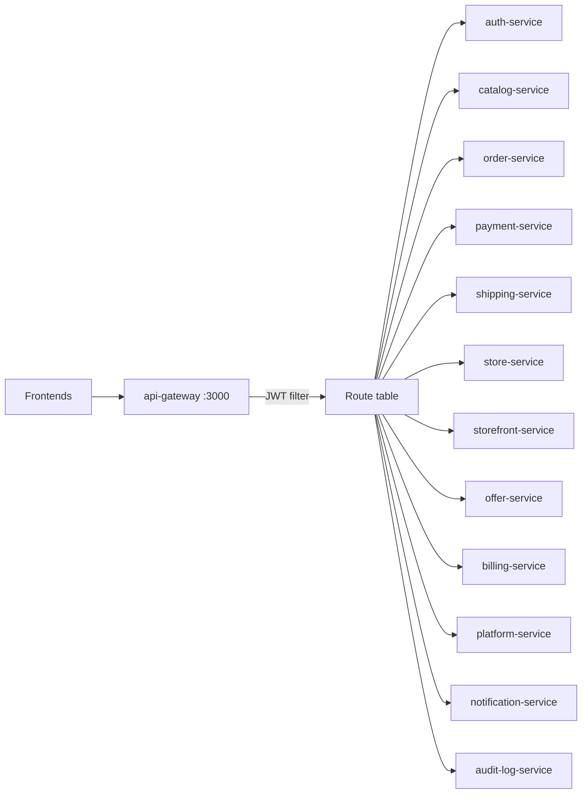

# api-gateway

Spring Cloud Gateway edge for the digi-carts platform. All browser and UI traffic should enter here on port **3000**.

Platform design: [digi-carts/doc — System design](https://github.com/digi-carts/doc/blob/main/architecture/system-design.md)

## Role

- Reverse-proxy to the 12 domain services
- Validate HMAC-SHA256 JWTs (`JJWT`) on non-public paths
- Inject `X-User-Id` and `X-User-Role` from JWT claims
- CORS for all origins (credentials allowed)

This service has **no database**.

## Tech stack

| Item | Value |
|------|--------|
| Language | Java 21 |
| Framework | Spring Boot 3.3.0 |
| Gateway | Spring Cloud Gateway 2023.0.3 |
| Auth | JJWT 0.12.6 |
| Runtime | Docker → Google Cloud Run |

## Architecture



## Route table

Configured in `src/main/resources/application.yml`. URIs default to Docker Compose-style hostnames and are overridden by Cloud Run env vars.

| Route id | Predicate paths | Downstream env | Default URI |
|----------|-----------------|----------------|-------------|
| auth-service | `/api/auth/**`, `/api/address/**` | `AUTH_SERVICE_URL` | `http://auth-service:3001` |
| platform-service | `/api/platform/**`, `/api/subscriptions/**`, `/api/admin/**`, `/api/templates/**`, `/api/support/**` | `PLATFORM_SERVICE_URL` | `http://platform-service:3002` |
| notification-service | `/api/notifications/**` | `NOTIFICATION_SERVICE_URL` | `http://notification-service:3003` |
| catalog-service | `/api/catalog/**`, `/api/products/**`, `/api/categories/**`, `/api/upload/**` | `CATALOG_SERVICE_URL` | `http://catalog-service:3004` |
| order-service | `/api/orders/**`, `/api/cart/**`, `/api/returns/**` | `ORDER_SERVICE_URL` | `http://order-service:3005` |
| payment-service | `/api/payments/**`, `/api/webhooks/**` | `PAYMENT_SERVICE_URL` | `http://payment-service:3006` |
| shipping-service | `/api/shipping/**` | `SHIPPING_SERVICE_URL` | `http://shipping-service:3007` |
| store-service | `/api/stores/**`, `/api/domain/**`, `/api/pages/**` | `STORE_SERVICE_URL` | `http://store-service:3008` |
| storefront-service | `/api/storefront/**` | `STOREFRONT_SERVICE_URL` | `http://storefront-service:3009` |
| offer-service | `/api/offers/**` | `OFFER_SERVICE_URL` | `http://offer-service:3010` |
| billing-service | `/api/billing/**`, `/api/bills/**` | `BILLING_SERVICE_URL` | `http://billing-service:3011` |
| audit-log-service | `/api/audit/**` | `AUDIT_LOG_SERVICE_URL` | `http://audit-log-service:3012` |

There is **no StripPrefix filter** in the current YAML. The full request path is forwarded. Downstream controllers often use unprefixed paths (`/users`, `/orders`). Align gateway predicates, rewrite filters, and controller mappings before production.

## JWT filter

`com.digicart.gateway.filter.JwtAuthFilter` (`GlobalFilter`, order `-1`):

**Public paths (no Bearer required):**

- `/api/auth/login`
- `/api/auth/register`
- `/api/auth/refresh`
- `/api/storefront/**`
- `/api/health`
- `/actuator/**`

**Protected paths:** require `Authorization: Bearer <token>`. Invalid or missing tokens return `401`.

On success, claims are copied:

| JWT | Header |
|-----|--------|
| `sub` | `X-User-Id` |
| `role` | `X-User-Role` |

Secret: `app.jwt.secret` ← `JWT_SECRET` (must match **auth-service**).

## Configuration

| Variable | Required | Default | Purpose |
|----------|----------|---------|---------|
| `PORT` | no | `3000` | Listen port |
| `JWT_SECRET` | **yes** | — | HMAC key (min length for HS256) |
| `*_SERVICE_URL` | prod | localhost-style hosts | Downstream Cloud Run URLs |

## Local run

```bash
export JWT_SECRET="local-dev-secret-at-least-32-chars!!"
export AUTH_SERVICE_URL=http://localhost:3001
# …set remaining *_SERVICE_URL as needed
mvn spring-boot:run
```

Docker: multi-stage Maven 3.9 + Temurin 21 JRE Alpine (`Dockerfile`). Exposes 3000.

## CI/CD

| Workflow | Trigger | Action |
|----------|---------|--------|
| `.github/workflows/deploy-dev.yml` | push `stage` | Build image `digi-cart-api-gateway-dev:latest`, update Cloud Run `digi-cart-api-gateway-dev` |
| `.github/workflows/deploy-prod.yml` | push `main` | Semver release + deploy `digi-cart-api-gateway` |

GCP: Artifact Registry `us-east1-docker.pkg.dev/{project}/digi-cart/`. Secret `GCP_DEV_SA_KEY` / `GCP_SA_KEY`.

## Source map

| Path | Notes |
|------|--------|
| `src/main/java/com/digicart/gateway/ApiGatewayApplication.java` | Boot entry |
| `src/main/java/com/digicart/gateway/filter/JwtAuthFilter.java` | Auth |
| `src/main/resources/application.yml` | Routes + CORS |

## Related docs

- [auth-service](https://github.com/digi-carts/auth-service/blob/stage/doc/README.md)
- [catalog-service](https://github.com/digi-carts/catalog-service/blob/stage/doc/README.md)
- [order-service](https://github.com/digi-carts/order-service/blob/stage/doc/README.md)
